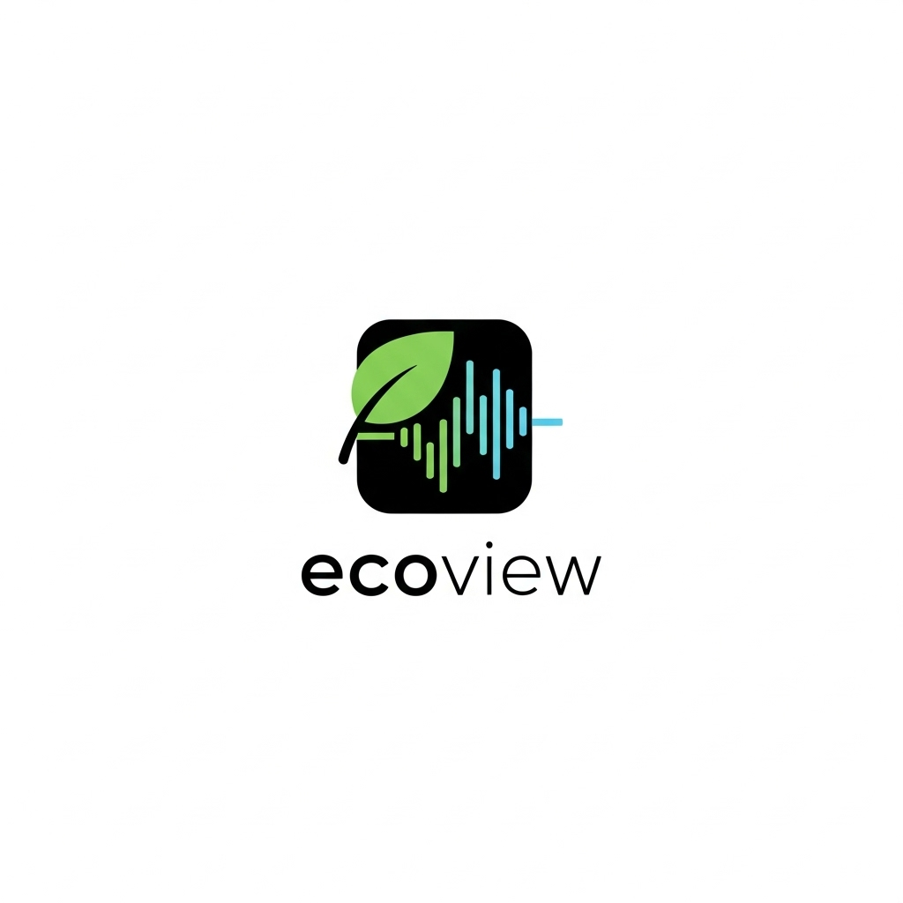

<div align="center">

# EcoView Greenhouse

Smart, themeable, cross‑platform monitoring for greenhouse environments — real‑time data, AI insights, and safety alerts.

</div>

---

## ⚠️ Important: Local Testing & Development Only

> **This application was developed and tested in a local development environment only.**
>
> **NOT deployed to:**
> - ❌ Google Play Store
> - ❌ Apple App Store
> - ❌ Production cloud environments
>
> **Testing scope:**
> - ✅ Local network deployment (same WiFi)
> - ✅ Direct APK installation on Android devices
> - ✅ Development environment testing
> - ✅ Local MQTT broker communication
>
> This project is suitable for academic demonstrations, proof-of-concept implementations, and local greenhouse monitoring within a single network. For production deployment to app stores or cloud environments, additional configuration and testing would be required.

---

## Overview

EcoView is a full‑stack application:

- Flutter frontend (Windows/macOS/Linux/Web/Android/iOS) with a clean earthy theme and responsive dashboard
- Python Flask backend that pulls live readings from Oracle APEX and exposes REST APIs
- Optional Google Gemini integration for AI analysis and recommendations

The system prioritizes real data: all sensor values come directly from APEX (no simulations), then thresholds are applied for statuses and alerts.

## Key Features

- Live dashboard: temperature, humidity, soil moisture, light, CO₂, air quality (MQ135), smoke (MQ2), CO (MQ7), flame
- One‑tap deep dive: click a dashboard card for analysis and historical trends (AI insights available)
- Sensors page: plain‑English explanations of each sensor, what it measures, and optimal ranges
- Alerts: consolidated safety and environment alerts with severity levels
- AI recommendations: Gemini‑backed guidance when enabled (fallback guidance built‑in)
- Export: backend endpoint to generate a comprehensive PDF report
- Auto‑discovery: frontend finds the backend on your LAN via UDP broadcast; or set IP in Settings

## Project Structure

```
sturdy-giggle/
├─ flutter_frontend/           # Flutter app (Material 3, earthy/dark themes)
│  ├─ lib/
│  │  ├─ main.dart             # Themes, app shell, navigation
│  │  ├─ screens/
│  │  │  ├─ dashboard_screen.dart        # Banner + responsive cards grid
│  │  │  ├─ sensor_info_screen.dart      # What each sensor does + optimal ranges
│  │  │  ├─ sensor_analysis_screen.dart  # Trends + AI insights (from dashboard)
│  │  │  ├─ settings_screen.dart         # Server discovery + manual IP override
│  │  ├─ services/
│  │  │  ├─ api_service.dart   # REST client, server discovery & health checks
│  │  │  └─ server_discovery.dart
│  ├─ assets/                  # App icon and images
│  └─ pubspec.yaml
├─ python_backend/
│  ├─ app.py                   # Flask app, APEX polling, routes, report export
│  ├─ gemini_service.py        # AI analysis (optional, with fallback)
│  ├─ requirements.txt
│  └─ THRESHOLDS.md            # Documented sensor thresholds and notes
└─ README.md                   # This file
```

## Prerequisites

- Windows 10/11, macOS, or Linux
- Python 3.10+ with pip
- Flutter SDK (3.x) and Dart SDK; platform toolchains for your target (Windows/Chrome recommended to start)

> Note: Two legacy helper scripts (`install_app.ps1`, `Run_EcoView_App.bat`) reference old paths; follow the steps below instead.

## Backend (Flask) — Setup and Run

1) Create a virtual environment and install dependencies

```powershell
cd python_backend
python -m venv .venv
.venv\Scripts\Activate.ps1
pip install -r requirements.txt
```

2) Configure environment variables (create a `.env` file next to `app.py`)

```
ORACLE_APEX_URL=https://oracleapex.com/ords/g3_data/iot/greenhouse/
# Optional for AI (Gemini):
GEMINI_API_KEY=your_api_key_here
```

3) Run the server (binds to all interfaces so other devices can connect)

```powershell
python app.py
```

What the backend does:

- Polls Oracle APEX every few seconds (persistent HTTP connection with pooling and gzip)
- Broadcasts its presence over UDP every 5s as `GREENHOUSE_SERVER:<ip>:5000` to help the app auto‑discover it
- Serves REST API at `http://<host>:5000/api`

### Core API Endpoints

- GET `/api/health` — status check
- GET `/api/sensor-data` — latest normalized readings + derived fields
- GET `/api/sensor-analysis/<sensor_type>` — stats and optional AI for one sensor
- GET `/api/sensor-analysis/<sensor_type>/ai` — AI analysis only
- GET `/api/ai-recommendations` — consolidated AI guidance
- GET `/api/alerts` — environment and safety alerts with severity
- GET `/api/export-report` — generate a PDF report

See `python_backend/THRESHOLDS.md` for the exact status bands used by the backend.

### Test Backend: "Saterday testing.py" (isolated)

For A/B testing or validating new Oracle APEX data without touching production, the repository includes an isolated backend at `python_backend/Saterday testing.py`.

- Purpose: points to the Saturday/APEX testing URL by default and mirrors the production routes and PDF export logic, so you can test end-to-end without changing `app.py`.
- Isolation: it runs as a separate Python process; it does not import or modify `app.py`, and nothing in `app.py` depends on it.
- Default port: 5000 (same as `app.py`). Don’t run both at the same time on the same machine unless you change one port.
- Default APEX URL: `https://oracleapex.com/ords/at2/greenhouse/sensor` (override with `ORACLE_APEX_URL` in `.env` if needed).

Run the testing backend:

```powershell
cd python_backend
# (optional) activate the same venv as production backend
.venv\Scripts\Activate.ps1
python "Saterday testing.py"
```

Notes:
- Because the testing backend uses its own file and process, stopping it has no impact on the main `app.py` server.
- If you need both to run simultaneously, start one of them on a different port (e.g., `5001`).
  You can do this by editing the last line in the file to `app.run(host='0.0.0.0', port=5001, debug=True)`.

## Frontend (Flutter) — Setup and Run

1) Install dependencies and run

```powershell
cd flutter_frontend
flutter pub get
flutter run -d windows  # or -d chrome / -d macos / -d linux / -d edge
```

2) Connecting to the backend

- Auto‑discovery: if the backend is running on the same network, the app will find it via UDP broadcast
- Manual: open Settings in the app and set the backend IP (and port if non‑default)

> Tip: On Windows, ensure Firewall allows inbound connections on port 5000.

### Dev quickstart (Windows)

You can use an automated PowerShell script that sets up Python, starts the backend, and runs Flutter.

```powershell
# From the repo root
Set-ExecutionPolicy -Scope Process RemoteSigned
./scripts/dev_quickstart.ps1               # defaults to -Device windows
./scripts/dev_quickstart.ps1 -Device chrome # run in Chrome instead
```

The script will:
- Create `.venv` in `python_backend` if missing
- Install backend requirements
- Start the Flask server in a new PowerShell window
- Run the Flutter app on Windows (or Chrome if Windows device isn’t available)

## Sensors and Optimal Ranges (Summary)

From `THRESHOLDS.md` and in‑app Sensor Info:

- Temperature: Optimal 20–27°C; Acceptable 18–20 or 27–30; Critical <18 or >30
- Humidity: Optimal 45–70%; Acceptable 71–80%; Critical <45 or >80
- Light (0–4095 raw): Dark 0–300; Low 301–819; Dim 820–1638; Moderate 1639–2457; Bright 2458+
- Air Quality (MQ135 ppm): Good ≤200; Moderate 201–500; Poor >500
- Smoke (MQ2 ppm): Safe ≤300; Elevated 301–750; High >750
- CO (MQ7 ppm): Safe ≤300; Elevated 301–750; High >750
- Soil Moisture (%): Optimal 40–60; Acceptable 30–40 or 60–70; Critical <30 or >70
- Flame: Boolean; “Flame Detected” triggers critical alert

## Theming and UI Notes

- Light theme: earthy palette (warm beige background, soil‑brown primary, olive secondary)
- Dark theme: eco‑tech green accents on deep green surfaces
- Inputs are consistently themed (TextField, Dropdown, SearchBar);
  banner uses the app icon; dashboard cards are responsive and clickable

## Troubleshooting

- Frontend can’t connect:
  - Verify backend is running and reachable at `http://<backend-ip>:5000/api/health`
  - Same LAN/Wi‑Fi? Firewall permits port 5000?
  - Set the server IP manually in the app Settings
- New asset not showing (e.g., app icon):
  - Do a Hot Restart, or stop the app and run `flutter run` again
  - `flutter clean` if still stuck, then rebuild
- AI responses missing:
  - Set `GEMINI_API_KEY` in backend `.env` and restart the server
  - The app includes robust fallback guidance if AI is unavailable

## Development Tips

- Backend: uses connection pooling to APEX; logs latest pull timestamps and temperatures for quick sanity checks
- Frontend: uses `server_discovery.dart` for UDP discovery and caches the IP in SharedPreferences
- The dashboard provides analysis and AI when you click a card; the Sensors page is for education and ranges

## Roadmap ideas

- Authentication and multi‑greenhouse support
- Push notifications and scheduled reports
- Packaging for Windows/macOS installers and Android/iOS stores

---

If you need help running the app in your environment, open an issue or ask for a tailored quickstart.

## Optional extras we can add

- Add screenshots (banner, dashboard, sensor info) to this README for visual clarity
- Provide a tiny "dev quickstart" PowerShell script that creates a virtualenv, installs Python deps, runs the backend, and launches the Flutter app on Windows

## Screenshots

Below are representative visuals. You can replace these with your own captures in `docs/screenshots/`.

- App icon (banner style)

  

- Dashboard (placeholder)

  Place a screenshot at `docs/screenshots/dashboard.png`, then replace this line with:
  ``

- Sensor Info (placeholder)

  Place a screenshot at `docs/screenshots/sensor-info.png`, then replace this line with:
  ``